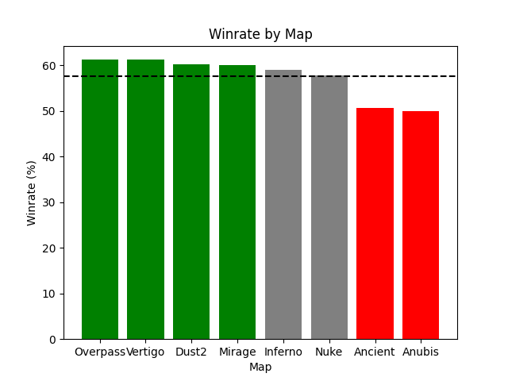

# 📊 Análise de Desempenho dos Mapas da FURIA com Machine Learning


---

## 📄 Introdução

Este projeto apresenta uma análise do desempenho da equipe FURIA em diferentes mapas, utilizando dados de winrate (% de vitórias) e modelos de Machine Learning.

O foco principal não é apenas classificar os mapas, mas analisar como diferentes modelos interpretam os dados e como suas abordagens impactam os resultados.

Foram utilizados dois modelos distintos:

1. **Regressão Logística**: abordagem baseada em probabilidade e tendência dos dados
2. **Árvore de Decisão**: abordagem baseada em regras e limites fixos

O objetivo é demonstrar como diferentes técnicas podem gerar interpretações distintas, especialmente em regiões próximas às fronteiras de decisão.

---

## 💡 Conceitos-Chave Abordados

* Análise de Dados com Pandas
* Visualização com Matplotlib
* Classificação de Dados
* Machine Learning Supervisionado
* Comparação de Modelos
* Interpretação de Resultados

---

## ⚙️ Metodologia

Os dados de winrate foram organizados em um DataFrame e processados para criação de uma métrica de desempenho.

```python
df['Performance'] = df['Winrate%'].apply(
    lambda x: 'High' if x > average_winrate + 2 else (
        'Low' if x < average_winrate - 1 else 'Medium'
    )
)
```

Essa classificação foi utilizada como base para o treinamento dos modelos.

---

## 🤖 Modelos Utilizados

### 📈 Regressão Logística

Modela a relação entre o winrate e a classificação, considerando a tendência geral dos dados.

### 🌳 Árvore de Decisão

Cria regras baseadas em limites fixos para classificar os mapas.

---

## 📊 Resultados Principais

A análise revelou diferenças importantes entre os modelos, especialmente próximas às fronteiras de decisão.

Para um valor de **59.5% de winrate**:

* Regressão Logística → **High**
* Árvore de Decisão → **Medium**

Isso evidencia que:

* A Regressão Logística realiza uma transição mais suave entre classes
* A Árvore de Decisão aplica cortes rígidos

Essa diferença indica uma zona de incerteza nos dados.

---

## 📈 Visualização

O gráfico abaixo representa o desempenho por mapa, com destaque para a média de winrate e a classificação por cores.



---

## 🧠 Conclusão

Os resultados demonstram que diferentes modelos podem interpretar os mesmos dados de maneiras distintas.

A divergência observada reforça a importância de considerar múltiplas abordagens e analisar cuidadosamente regiões próximas às fronteiras de decisão.

---

## 📌 Possíveis Extensões

* Adição de novas variáveis (ex: desempenho por lado)
* Uso de datasets maiores
* Teste com outros modelos de classificação
* Avaliação com métricas adicionais

